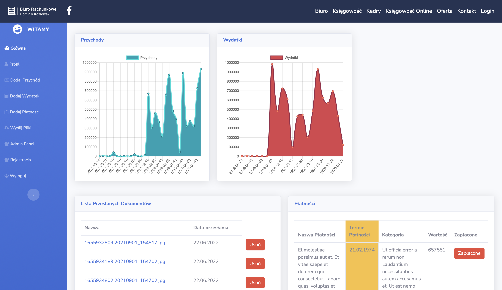
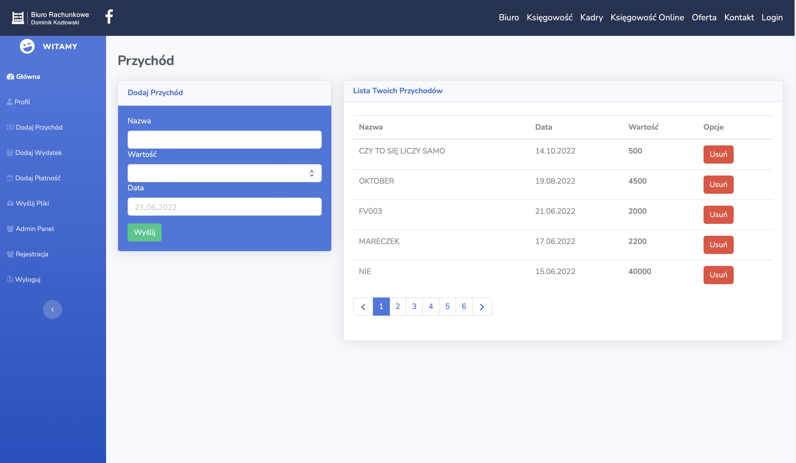
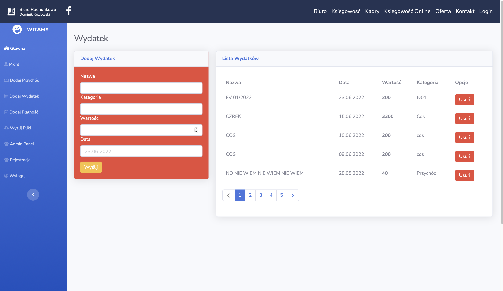
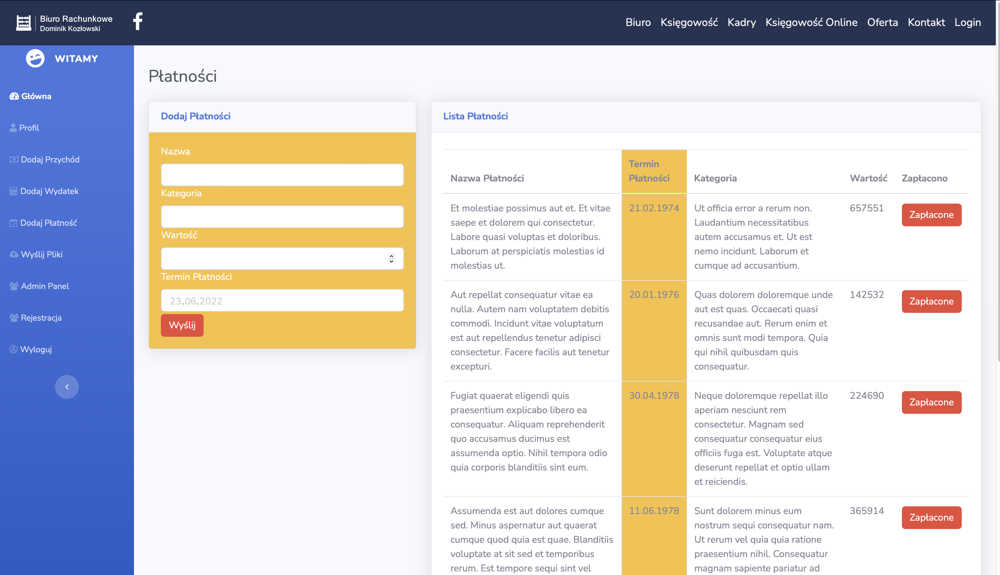
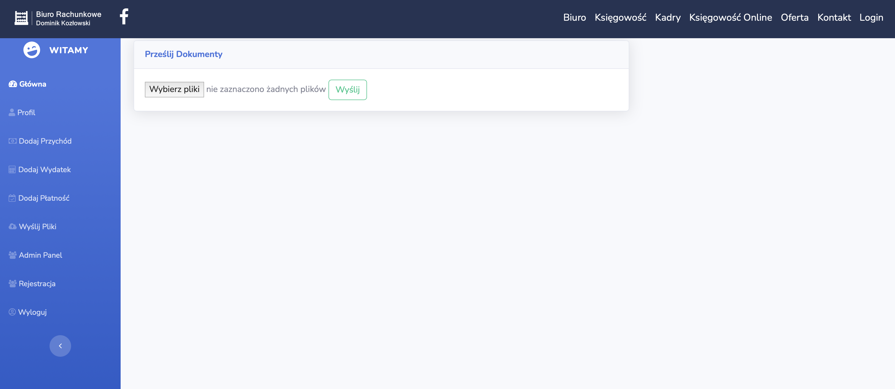
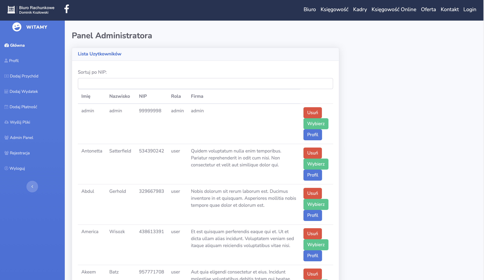

# Account Assistant

Account Assistant is a simple application to upload invoices file on server and monitoring your income, expense and planning payments.


## Screenshots

### Dashboard

 View dashboard includes a linear chart: income and expense, simple list uploaded file


### Income



### Expense



### Payment


### File Upload

 Multiple file upload with validate type:,img,png,pdf


### Admin panel




## Getting Started

* You should download and install the Vue Chartjs, Vue Smart Table, Router package.
* Create a database in phpMyAdmin and name it Account.
* To download the project write command:
```
git clone https://github.com/pxmaciej/AccountAssistant.git
```


### Prerequisites

You should download and install the Vue Chartjs package.
In terminal write:
```
$ npm i vue-chartjs chart.js
```

You should download and install the Vue Smart Table package.
In terminal write:
```
$ npm install vuejs-smart-table@next
```

You should download and install the Router package.
In terminal write:
```
$ npm install vue-router
```


### Installing

In terminal write:
```
cp .env example .env.
```
Complete the database login information in the .env file.
Enter the command generating a new key:
```
php artisan key: generate.
```
Enter the command to migrate data to the database: 
```
php artisan migrate.
```
Enter the command to create default objects in the database:
```
php artisan db: seed.
```
Enter the command creating the default objects in the database:
```
php craftsman to serve.
```
In your browser, go to:
```
http://127.0.0.1:8000e
```


## Built With

* [Laravel](https://laravel.com/docs/7.x/installation) - The back-end framework used Laravel
* [Boostrap](https://getbootstrap.com/) - The front-end framework used Bootstrap
* [Boostrap](https://sass-lang.com/) - The front-end framework used SASS
* [Larafy](https://github.com/rennokki/larafy) - The library to support Spotify API
* [Vue Chartjs](https://github.com/apertureless/vue-chartjs) - The library to Vue Chart
* [Vue Smart Table](https://github.com/tochoromero/vuejs-smart-table) - The library to support Vue Table
* [Router](https://github.com/vuejs/vue-router) - The library to support Vue Routes
* [Composer](https://getcomposer.org/) - Dependency Management
* [npm](https://nodejs.org/en/) - The npm packages manager from Node.js
* [Apache](https://www.apachefriends.org/pl/index.html) - MySql database and Apache server


## Authors

* **Maciej Zienkiewicz** - *Initial work* - [myRepo](https://github.com/pxmaciej).
